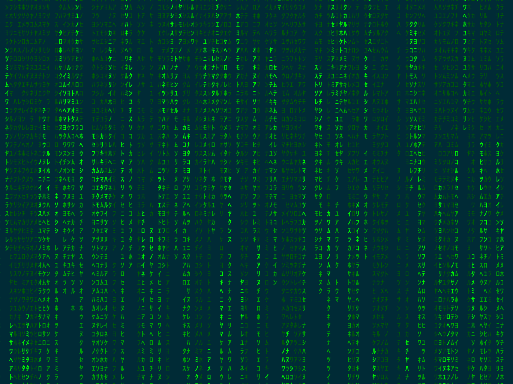

# Matrix Digital Rain

Inspired by amstrad's [oh-my-matrix](https://github.com/amstrad/oh-my-matrix/blob/master/README.md) GitHub repo.
 
Turns your terminal into a matrix script.


#### Requirements 
- oh-my-zsh
- Python (Run "python" into your terminal to confirm you have python installed)


#### Install 

1. Clone this repository in oh-my-zsh's plugins directory:

        git clone https://github.com/codebusta/matrix-digital-rain ${ZSH_CUSTOM:-~/.oh-my-zsh/custom}/plugins/matrix-digital-rain

2. Activate the plugin in `~/.zshrc`:

        plugins=( [plugins...] matrix-digital-rain)

3. Source `~/.zshrc`  to take changes into account:

        source ~/.zshrc


#### Start script running:
```
    matrix
```

